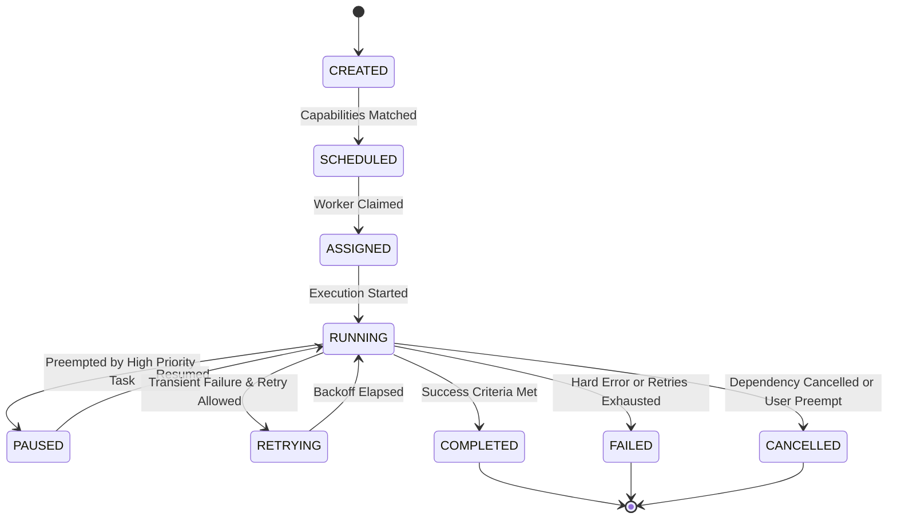

# PenFlow Agent Communication Protocol Specification (ACP v1.0)
## Production-Grade System Architecture Document

**Document Version:** 1.0.0  
**Author:** Principal Software Architect, PenFlow Platform  
**Status:** Permanent Architectural Specification  
**Target Audience:** Senior Engineering Team, Lead Platform Developers  

---

## Executive Summary & Architectural Mandate

PenFlow is an autonomous security research platform engineered to operate with the cognitive workflow of a senior security engineering team. PenFlow rejects traditional monolithic scanner architectures. Instead, it enforces a strictly decoupled, asynchronous, event-driven, actor-based micro-agent swarm communicating exclusively over the **Agent Communication Protocol (ACP v1.0)**.

No component inside PenFlow is permitted to invoke another component via direct, un-brokered function calls or informal APIs. Every observation, command, task assignment, result, finding candidate, and knowledge update MUST be encapsulated inside a valid ACP v1.0 Message Envelope and routed via certified Event and Command Buses.

---

## Section 1: Core Architectural Paradigms

PenFlow's communication infrastructure is grounded in three foundational software engineering paradigms:

### 1.1 Domain-Driven Design (DDD)
The domain is partitioned into bounded contexts corresponding to the four primary operational worlds:
- **Knowledge World:** Universal security concepts, attack techniques, playbooks, research, and heuristic patterns.
- **Target World:** Real-world assets, programs, endpoints, parameters, technologies, identities, and sessions.
- **Execution World:** Tactical goals, DAG plans, tasks, workflows, executions, and observations.
- **Result World:** Candidates, verified findings, evidence bundles, confidence metrics, and audit reports.

### 1.2 Event-Driven Architecture (EDA)
State changes inside PenFlow are communicated as immutable, timestamped domain events published to topic-based pub/sub buses. Producers have zero knowledge of consumers, enforcing spatial and temporal decoupling.

### 1.3 Actor-Based Concurrency Model
Every agent inside PenFlow behaves as an isolated Actor with:
- Dedicated private state (Working Memory).
- A message mailbox (Task & Event Queues).
- Independent event-driven execution loops.
- Zero shared mutable state across thread or process boundaries.

#### Section Analysis
- **Rationale:** Decouples agent implementations completely from platform orchestration, enabling 100+ specialized agents to run concurrently across distributed nodes.
- **Tradeoffs:** Introduces slight latency overhead due to message serialization and asynchronous bus routing compared to in-memory function calls.
- **Future Extensibility:** Seamlessly scales from single-node execution to multi-cloud kubernetes agent clusters.
- **Risks:** Eventual consistency latency must be bounded to prevent race conditions during state transitions.

---

## Section 2: Domain-Driven Message Hierarchy & Definitions

All message structures in PenFlow inherit from a single polymorphic base message type.

```
                         BaseMessage
                              │
     ┌──────────────┬─────────┴───────┬──────────────┬──────────────┐
     │              │                 │              │              │
Observation      Command            Event          Task         TaskResult
     │                                │              │
     ▼                                ▼              ▼
FindingEvidence               KnowledgeUpdate    FindingCandidate
```

### 2.1 BaseMessage (Abstract Parent)
- **Attributes:** `message_id` (UUIDv4), `correlation_id` (UUIDv4), `causation_id` (UUIDv4), `timestamp` (Epoch UTC), `sender` (ActorID), `recipient` (ActorID or Broadcast), `acp_version` (String), `priority` (Enum).

### 2.2 Observation
- Encapsulates raw, un-analyzed telemetry captured from target interactions.
- **Attributes:** `observation_id`, `target_id`, `source_type` (HTTP, DOM, DNS, TLS), `raw_payload` (Bytes/Dict), `context_hash` (SHA-256).

### 2.3 Command
- An imperative request instructing a specific Actor/Agent to execute an intent.
- **Attributes:** `command_type`, `target_actor`, `parameters`, `deadline`.

### 2.4 Event
- An immutable notification stating that a specific domain state change has occurred.
- **Attributes:** `event_type`, `topic`, `domain_context`, `event_data`.

### 2.5 Task
- A discrete, capability-matched unit of work scheduled by the Planner.
- **Attributes:** `task_id`, `goal_id`, `required_capability`, `dag_dependencies` (List[TaskID]), `priority`, `timeout_seconds`, `retry_policy`, `payload`.

### 2.6 TaskResult
- The complete execution output emitted by a Worker upon Task termination.
- **Attributes:** `task_id`, `status` (Completed/Failed), `execution_time_ms`, `output_data`, `error_details`.

### 2.7 Finding (Candidate & Verified)
- Represents a security defect hypothesis.
- **Attributes:** `finding_id`, `candidate_id`, `vuln_type`, `target_id`, `endpoint_id`, `confidence_score` (0.0 to 1.0), `evidence_bundle_id`, `critic_verdict`.

### 2.8 Evidence
- The cryptographic and diagnostic proof supporting a Finding.
- **Attributes:** `evidence_id`, `har_log`, `raw_http_traces`, `screenshots`, `reproduction_script`.

### 2.9 KnowledgeUpdate
- Updates to universal security techniques, playbooks, or attack patterns.
- **Attributes:** `update_id`, `concept`, `technique_name`, `pattern_schema`.

### 2.10 Experience
- Cross-program statistical heuristics learned over historic executions.
- **Attributes:** `experience_id`, `tech_stack_fingerprint`, `technique_id`, `historical_success_rate`, `sample_size`.

#### Section Analysis
- **Rationale:** Polymorphic inheritance allows uniform message validation, serialization, and logging while supporting rich domain payloads.
- **Tradeoffs:** Larger message payloads require strict schema validation overhead.
- **Future Extensibility:** New domain types can be added without altering the core messaging pipeline.
- **Risks:** Uncontrolled schema growth if message definitions are modified without strict RFC processes.

---

## Section 3: State Machine & Task Lifecycle Specification

Tasks move through a strict, deterministic, non-reversible state machine.



### 3.1 Lifecycle States Definition
1. **CREATED:** Instantiated by Planner Agent with DAG dependencies defined.
2. **SCHEDULED:** Matched against Capability Registry and enqueued in Task Queue.
3. **ASSIGNED:** Claimed by a specialized Worker Agent with resources locked.
4. **RUNNING:** Active execution by Worker Agent.
5. **PAUSED:** Suspended due to Resource Controller preemption or Rate Limit backoff.
6. **RETRYING:** Failed execution undergoing exponential backoff delay before re-execution.
7. **COMPLETED:** Successful execution emitting a valid `TaskResult`.
8. **FAILED:** Final failure state after retries or hard unrecoverable fault.
9. **CANCELLED:** Terminal abort triggered by upstream DAG failure or explicit user preemption.

#### Section Analysis
- **Rationale:** Explicit state transitions eliminate ambiguous task states in distributed clusters.
- **Tradeoffs:** State persistence requires synchronous state write-ahead logging.
- **Future Extensibility:** Paused states allow live worker migration across cluster nodes.
- **Risks:** Deadlocks if worker crashes during ASSIGNED state without heartbeat monitoring.

---

## Section 4: Event Bus Architecture

The PenFlow Event Bus is a high-throughput, asynchronous publish-subscribe message broker.

```
                    ┌─────────────────────────┐
                    │     ACP Event Bus       │
                    └────────────┬────────────┘
                                 │
     ┌───────────────────────────┼───────────────────────────┐
     ▼                           ▼                           ▼
Topic: recon.*             Topic: findings.*          Topic: system.*
(ReconAgent Pub)          (SecurityTeams Pub)        (Orchestrator Pub)
     │                           │                           │
     ▼                           ▼                           ▼
Planner Subscriber        Critic Subscriber          Observability Sub
```

### 4.1 Topology & Delivery Guarantees
- **Pattern:** Topic-based Publish/Subscribe with wildcard routing.
- **Guarantee:** At-least-once delivery with id-based deduplication at subscriber mailboxes.
- **Persistence:** Durable disk-backed log with configurable retention per topic.

#### Section Analysis
- **Rationale:** Decouples event producers from multiple simultaneous consumers.
- **Tradeoffs:** Requires idempotency keys in all event consumers.
- **Future Extensibility:** Can swap backend from in-memory AsyncIO bus to Apache Kafka or RabbitMQ.
- **Risks:** Slow consumer bottleneck if subscriber processing queues fill up.

---

## Section 5: Command Bus Architecture

The Command Bus manages point-to-point, intent-driven operations requiring deterministic execution.

### 5.1 Topology & Routing
- **Pattern:** Point-to-Point Direct Routing via Agent Capability Addresses.
- **Guarantee:** Exactly-once execution semantics enforced via Command Lock Registry.
- **Backpressure:** Rejects new commands if target Agent's command queue depth exceeds limit.

#### Section Analysis
- **Rationale:** Ensures administrative and control actions (e.g. Stop Scan, Resume Task) execute deterministically.
- **Tradeoffs:** Tight coupling to recipient agent's availability.
- **Future Extensibility:** Supports distributed command RPC calls.
- **Risks:** Command queue saturation under heavy loads.

---

## Section 6: Agent Lifecycle Specification

Every Agent inside PenFlow adheres to a standard 8-stage operational lifecycle:

1. **Initialize:** Load configuration, initialize Working Memory, set up internal channels.
2. **Register:** Connect to ACP Bus, establish identity with Security Engine.
3. **Advertise Capabilities:** Register supported capabilities, version, and cost metrics with Capability Registry.
4. **Receive Task:** Claim or accept matched tasks from Worker Scheduler.
5. **Execute:** Execute task within sandbox boundary, monitoring deadline and timeouts.
6. **Emit Events:** Stream intermediate observations and events to Event Bus.
7. **Publish Findings:** Submit candidate findings to Critic Validation Queue.
8. **Cleanup:** Flush logs, release locked resources, return to standby or terminate.

#### Section Analysis
- **Rationale:** Standardizes agent behavior regardless of underlying programming language or framework.
- **Tradeoffs:** Registration overhead on agent startup.
- **Future Extensibility:** Facilitates dynamic plugin loading and runtime agent upgrades.
- **Risks:** Unclean termination if agent crashes during cleanup phase.

---

## Section 7: Capability Registry Specification

The Capability Registry decoupling task assignment from specific agent instances.

```
                           Planner Agent
                                │
                        Requests Task for:
                    capability="id_access_analysis"
                                │
                                ▼
                    ┌─────────────────────────┐
                    │   Capability Registry   │
                    └────────────┬────────────┘
                                 │
     ┌───────────────────────────┼───────────────────────────┐
     ▼                           ▼                           ▼
IDORAgent v2 (Local)        IDORAgent v3 (Cloud)       AI-IDORAgent (LLM)
Cost: 0.1 / Priority: 1     Cost: 0.5 / Priority: 2     Cost: 2.0 / Priority: 3
                                 │
                                 ▼
                     Registry Selects Optimal Agent
```

### 7.1 Registration Schema
- `agent_id`: Globally unique identifier.
- `capabilities`: List of capability strings (e.g., `["web_crawling", "id_access_analysis", "graphql_introspection"]`).
- `cost_factor`: Resource cost metric (0.0 = free local, 10.0 = expensive reasoning API).
- `supported_inputs`: JSON Schema of accepted payload.
- `produced_outputs`: JSON Schema of generated results.

#### Section Analysis
- **Rationale:** Allows multiple specialized agents to offer the same capability, enabling dynamic routing based on cost, load, and version.
- **Tradeoffs:** Requires maintaining strict JSON schemas for input/output compatibility.
- **Future Extensibility:** Enables A/B testing of different security testing agents side-by-side.
- **Risks:** Misconfigured capability strings leading to unroutable tasks.

---

## Section 8: Worker Scheduler & DAG Dependency Protocol

The Worker Scheduler resolves task dependencies and dispatches tasks as Directed Acyclic Graphs (DAGs).

### 8.1 DAG Resolution & Execution
- Tasks specify dependencies via `dag_dependencies: [TaskID_A, TaskID_B]`.
- A Task CANNOT enter `SCHEDULED` state until all parent tasks reach `COMPLETED` state.
- If a parent task transitions to `FAILED` or `CANCELLED`, all downstream dependent tasks immediately transition to `CANCELLED`.

#### Section Analysis
- **Rationale:** Prevents executing downstream security tests before prerequisites (e.g., Recon and Authentication) are satisfied.
- **Tradeoffs:** Requires global DAG validation on every plan update to detect circular dependencies.
- **Future Extensibility:** Allows parallel execution of independent DAG branches across multiple workers.
- **Risks:** Long-running bottleneck tasks delaying entire DAG subtrees.

---

## Section 9: Message Serialization & Schema Contract

### 9.1 Serialization Specification
- **Primary Wire Format:** JSON (RFC 8259) with strict UTC ISO-8601 timestamps.
- **High-Performance Binary Wire Format:** Protocol Buffers (v3) for high-frequency internal telemetry streams.
- **Encoding:** UTF-8 mandatory for string fields.

#### Section Analysis
- **Rationale:** JSON ensures human readability during debugging and audit log inspection; Protobuf offers maximum network efficiency.
- **Tradeoffs:** Maintaining dual schemas (JSON Schema and Proto3) requires automated codegen tooling.
- **Future Extensibility:** Easy migration to Apache Avro or FlatBuffers if required.
- **Risks:** Data precision loss during floating-point confidence score serialization if not strictly formatted.

---

## Section 10: Versioning & Backward Compatibility Strategy

### 10.1 Semantic Versioning Schema
- ACP Protocol follows Semantic Versioning `MAJOR.MINOR.PATCH` (e.g., `1.0.0`).
- `MAJOR`: Breaking schema changes, field removals, or lifecycle state additions.
- `MINOR`: Backward-compatible new fields, message types, or capabilities.
- `PATCH`: Internal bug fixes, description updates.

### 10.2 Backward Compatibility Guarantees
- Message consumers MUST ignore unknown JSON fields (Forward-compatible parsing).
- Field removals in `MAJOR` versions require a minimum 2-version deprecation window.

#### Section Analysis
- **Rationale:** Prevents breaking running deployments when upgrading platform components.
- **Tradeoffs:** Slightly increased message parsing logic complexity.
- **Future Extensibility:** Multiple protocol versions can coexist in the same cluster during rolling upgrades.
- **Risks:** Deprecated fields lingering indefinitely if version deprecation deadlines are not enforced.

---

## Section 11: Priority, Preemption & Resource Scheduling

### 11.1 Priority Levels
1. **CRITICAL (P0):** Emergency commands, system shutdowns, preemption triggers.
2. **HIGH (P1):** Active security hypothesis testing, verification checks.
3. **NORMAL (P2):** Standard crawling, recon, API discovery tasks.
4. **LOW (P3):** Background learning, writeup analysis, report compilation.

### 11.2 Preemption Protocol
When a `P0` or `P1` task is scheduled and worker pool capacity is saturated, the Economy Agent pauses or preempts running `P3` tasks, moving them to `PAUSED` state.

#### Section Analysis
- **Rationale:** Guarantees critical security findings and emergency commands execute immediately without queuing delay.
- **Tradeoffs:** Preempted tasks require state serialization to support clean resumption.
- **Future Extensibility:** Can integrate custom SLA-driven priority queues.
- **Risks:** Priority starvation of low-priority background learning tasks under constant high load.

---

## Section 12: Retry & Exponential Backoff Semantics

### 12.1 Retry Logic
- Failed tasks with transient errors (e.g., network timeouts, rate limits) transition to `RETRYING`.
- **Backoff Formula:** `delay = min(max_delay, initial_delay * (2 ^ attempt)) + jitter`
- **Jitter:** Full random jitter between `0` and `delay` to prevent thundering herd problems against target servers.
- **Max Retries:** Default `3` attempts before final transition to `FAILED`.

#### Section Analysis
- **Rationale:** Prevents temporary network glitches or target rate-limiting from causing false task failures.
- **Tradeoffs:** Retries extend total task execution time window.
- **Future Extensibility:** Custom retry policies per capability type (e.g., HTTP vs DNS).
- **Risks:** Over-retrying against unstable target servers causing IP bans.

---

## Section 13: Timeout & Deadline Semantics

### 13.1 Timeout Enforcement
- Every Task specifies `soft_timeout_seconds` and `hard_timeout_seconds`.
- **Soft Timeout:** Triggers graceful task wrapping, emitting partial observations captured so far.
- **Hard Timeout:** Forcefully terminates the worker task boundary, emitting a `TaskTimeoutFault` event.

#### Section Analysis
- **Rationale:** Guarantees no single hanging HTTP request or infinite loop can block system resources indefinitely.
- **Tradeoffs:** Partial results on soft timeout may require special validation handling.
- **Future Extensibility:** Dynamic timeout adjustment based on target responsiveness.
- **Risks:** Setting timeouts too aggressively cutting off valid long-running operations.

---

## Section 14: Cascade Cancellation Semantics

### 14.1 Cancellation Protocol
- When a parent task or target scan is cancelled, a `TaskCancelled` command propagates down the entire DAG tree.
- All dependent sub-tasks in `CREATED`, `SCHEDULED`, or `PAUSED` states transition to `CANCELLED` immediately without consuming worker slots.

#### Section Analysis
- **Rationale:** Eliminates wasted CPU and network requests on tasks whose dependencies are no longer valid.
- **Tradeoffs:** Requires real-time DAG tree traversal during cancellation events.
- **Future Extensibility:** Supports selective branch cancellation without aborting sibling tasks.
- **Risks:** Orphan tasks if cancellation message delivery fails.

---

## Section 15: Confidence Propagation & Scoring Algebra

PenFlow uses a rigorous, deterministic mathematical algebra to calculate and aggregate confidence scores for security findings.

### 15.1 Confidence Formula
$$Confidence = S_{baseline} \times W_{method} \times (1 - D_{deviation}) \times V_{critic}$$

Where:
- $S_{baseline}$: Initial detector baseline score (0.0 to 1.0).
- $W_{method}$: Weight of testing technique (e.g., Cross-session token swap = 0.95, Single-session parameter fuzzing = 0.60).
- $D_{deviation}$: Deviation penalty for unverified response changes.
- $V_{critic}$: Critic Agent verification multiplier (Verified = 1.0, Unverified = 0.5, Disproven = 0.0).

### 15.2 Confidence Action Thresholds
- **$0.90 \le Confidence \le 1.00$:** Verified Finding $\rightarrow$ Emitted directly to Human Review Queue.
- **$0.50 \le Confidence < 0.90$:** Candidate Finding $\rightarrow$ Sent to Critic Agent for Falsification Re-test.
- **$Confidence < 0.50$:** Insufficient Evidence $\rightarrow$ Discarded automatically to reduce noise.

#### Section Analysis
- **Rationale:** Eliminates subjective confidence guessing by substituting a deterministic mathematical scoring pipeline.
- **Tradeoffs:** Weights and baseline multipliers must be tuned based on empirical testing data.
- **Future Extensibility:** Experience Agent can dynamically update technique weight multipliers based on historic outcomes.
- **Risks:** Miscalibrated weights allowing low-quality candidate findings to pass to human review.

---

## Section 16: Immutable Audit Trail & Provenance Specification

Every event, command, task, finding, and decision inside PenFlow is recorded in an immutable, append-only Audit Trail log.

### 16.1 Cryptographic Chain Integrity
- Each audit log block includes the SHA-256 hash of the previous log block:
$$BlockHash_n = \text{SHA-256}(BlockData_n \parallel BlockHash_{n-1})$$
- Ensures complete tamper-evident data provenance for compliance, legal disclosure, and security reviews.

#### Section Analysis
- **Rationale:** Guarantees absolute proof of what actions were taken by which agent at what exact time.
- **Tradeoffs:** Storage overhead for long-running target campaigns.
- **Future Extensibility:** Audit trails can be exported as legal compliance bundles for enterprise bug bounty reports.
- **Risks:** High disk IOPS requirements if audit logging is not properly buffered.

---

## Section 17: Observability Architecture

The platform provides full operational visibility via three telemetry pillars:

### 17.1 Telemetry Pillars
1. **Metrics (Prometheus):** Active task counts, message throughput, queue depths, error rates, LLM API expenditure.
2. **Structured Logs (JSON):** Context-enriched logs containing `correlation_id`, `target_id`, `agent_name`, and `trace_id`.
3. **Distributed Tracing (OpenTelemetry):** End-to-end trace context propagated across ACP message boundaries from initial Recon request to final Finding Report.

#### Section Analysis
- **Rationale:** Enables instant diagnostic capability when debugging agent swarm interactions or bottlenecks.
- **Tradeoffs:** Trace context propagation requires injecting trace headers into all ACP message envelopes.
- **Future Extensibility:** Plug-and-play integration with Grafana, Jaeger, and Datadog.
- **Risks:** Verbose tracing overhead in high-throughput scanning environments.

---

## Section 18: Security, Integrity & Anti-Replay Architecture

### 18.1 Security Safeguards
1. **Authentication:** All agents must present valid Cryptographic Tokens (HMAC-SHA256) upon connecting to the ACP Bus.
2. **Authorization (RBAC):** Agents are granted least-privilege bus topic permissions (e.g., ReconAgent can publish to `recon.*` but cannot publish to `findings.*`).
3. **Message Integrity:** Payload signatures validated using HMAC-SHA256 signatures embedded in message envelopes.
4. **Anti-Replay Protection:** Messages include a monotonically increasing nonce and a 300-second timestamp freshness window; expired or duplicate nonces are rejected immediately.

#### Section Analysis
- **Rationale:** Prevents rogue or compromised worker agents from injecting fake security findings or hijacking scan control.
- **Tradeoffs:** Cryptographic verification adds sub-millisecond CPU overhead per message.
- **Future Extensibility:** Zero-Trust mutual TLS (mTLS) for multi-node distributed agent clusters.
- **Risks:** Key distribution complexity across ephemeral containerized agent workers.

---

## Section 19: Interface Contracts (Abstract Type Signatures Only)

*(Note: No implementation code. Type signatures defined for language-agnostic SDK implementation.)*

```typescript
// Abstract Interface Signatures for PenFlow Core SDK

interface IACPMessageEnvelope {
  readonly message_id: string;
  readonly correlation_id: string;
  readonly causation_id: string;
  readonly timestamp: number;
  readonly sender: { team: string; agent: string };
  readonly recipient: { team: string; agent: string };
  readonly intent: string;
  readonly message_type: string;
  readonly payload: Record<string, unknown>;
  readonly meta: { priority: string; ttl_seconds: number };
  
  serialize(): string;
  validate(): boolean;
}

interface IACPAgentActor {
  readonly agent_id: string;
  readonly name: string;
  readonly role: string;
  readonly capabilities: string[];
  
  initialize(config: Record<string, unknown>): Promise<void>;
  register(bus: IACPEventBus): Promise<void>;
  advertiseCapabilities(registry: ICapabilityRegistry): Promise<void>;
  receiveTask(task: IACPMessageEnvelope): Promise<void>;
  executeTask(task: IACPMessageEnvelope): Promise<IACPMessageEnvelope>;
  publishEvent(event: IACPMessageEnvelope): Promise<void>;
  cleanup(): Promise<void>;
}

interface IACPEventBus {
  publish(topic: string, message: IACPMessageEnvelope): Promise<void>;
  subscribe(topic: string, handler: (message: IACPMessageEnvelope) => Promise<void>): Promise<void>;
  unsubscribe(topic: string): Promise<void>;
}

interface ICapabilityRegistry {
  registerAgentCapabilities(agent_id: string, capabilities: string[], cost_factor: number): Promise<void>;
  findBestAgentForCapability(capability: string, constraints: Record<string, unknown>): Promise<string>;
}

interface IDAGScheduler {
  buildDAG(plan_id: string, tasks: IACPMessageEnvelope[]): Promise<void>;
  getNextRunnableTasks(plan_id: string): Promise<IACPMessageEnvelope[]>;
  markTaskComplete(task_id: string): Promise<void>;
  cancelDownstreamTasks(task_id: string): Promise<void>;
}
```

---

## Section 20: Master Production Readiness & Implementation Checklist

To certify that PenFlow components comply with ACP v1.0, the engineering team must satisfy the following criteria:

- [ ] **Schema Compliance:** All message definitions inherit from `BaseMessage` and pass strict validation.
- [ ] **Bus Isolation:** Zero direct in-memory calls between Agents; 100% of communication routed over ACP Bus.
- [ ] **Lifecycle Adherence:** Task state transitions follow the exact 9-state machine without illegal skips.
- [ ] **Capability Matching:** Tasks dispatched strictly by capability strings via Capability Registry.
- [ ] **Adversarial Falsification:** Candidate findings routed to Critic Agent before reaching Human Review.
- [ ] **Audit Trail Integrity:** Cryptographic SHA-256 block chain verification enabled on all logs.
- [ ] **Observability Verification:** OpenTelemetry trace headers injected and propagated across all message boundaries.

---
*End of PenFlow Agent Communication Protocol Specification (ACP v1.0)*  
*Certified for Production Engineering by Principal Software Architect.*
