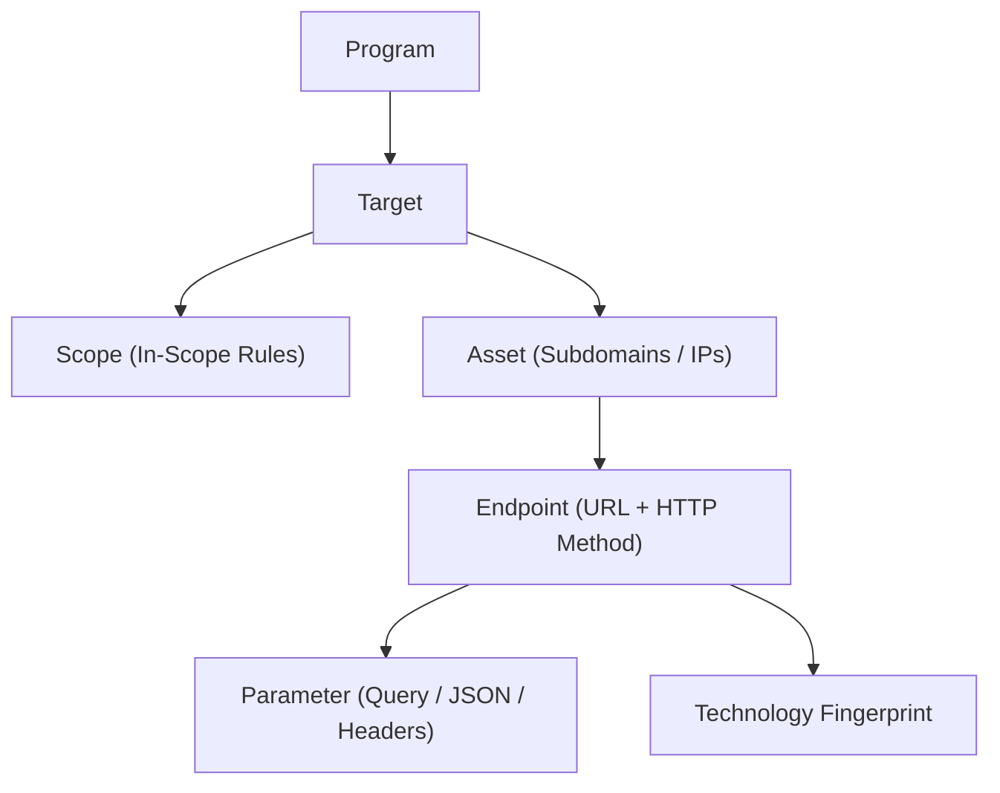
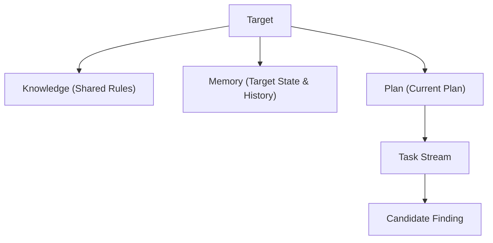
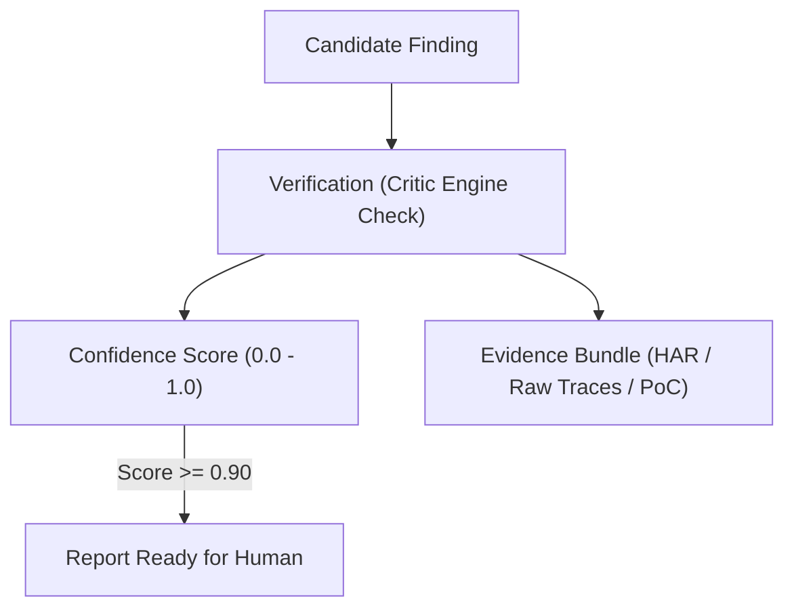
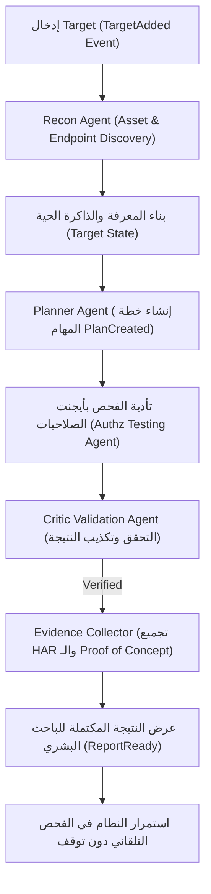

# 🏛️ وثيقة التصميم الهندسي للمرحلة 0 (Phase 0 — System Design & Domain Model)
## منصة PenFlow للأبحاث الأمنية المستقلة (Autonomous Security Research Platform)

هذه الوثيقة هي **العقد البرمجي والهندسي الموحد (System Contract)** الذي يحدد جميع الكيانات، العلاقات، الأحداث، أدوار الأيجنتات، وهيكلية الذاكرة والمعرفة قبل كتابة أي كود تنفيذي، لضمان عدم إعادة كتابة أي جزء في المستقبل.

---

## 📌 1. الكيانات والمفاهيم الأساسية (Phase 0.1 — Domain Vocabulary)

يتكون النظام من 24 كياناً أساسياً تمثل لغة المشروع الموحدة (Ubiquitous Language):

```
┌─────────────────────────────────────────────────────────────────────────────┐
│                             Domain Vocabulary                               │
├─────────────────────────────────────────────────────────────────────────────┤
│ 1. Program         2. Target            3. Scope           4. Asset         │
│ 5. Endpoint        6. Parameter         7. Technology      8. Identity      │
│ 9. Session        10. Observation      11. Event          12. Task          │
│ 13. Plan          14. Finding          15. Evidence       16. Verification  │
│ 17. Confidence    18. Knowledge        19. Technique      20. Playbook      │
│ 21. Agent         22. Capability       23. Memory         24. Snapshot      │
└─────────────────────────────────────────────────────────────────────────────┘
```

### تعريف الكيانات:
* **Program:** البرنامج العام (مثل برنامج Bug Bounty أو نطاق المؤسسة).
* **Target:** الهدف المحدد الفردي (مثل `app.target.com`).
* **Scope:** حدود النطاق المصرح به (In-Scope / Out-of-Scope URLs & IPs).
* **Asset:** أي أصل تقني ينتمي للهدف (Subdomain, IP, Service, Port).
* **Endpoint:** نقطة النهاية للطلب (مثل `/api/v1/invoices` + HTTP Method).
* **Parameter:** المتغير المستلم أو المرسل (Query, Header, Body JSON key).
* **Technology:** التقنيات المكتشفة (Next.js, GraphQL, PostgreSQL, JWT, OAuth).
* **Identity:** هوية الحساب في النظام (User A, User B, Admin, Guest).
* **Session:** حالة الجلسة المفعلة (Headers, Cookies, Tokens الخاصة بهوية معينة).
* **Observation:** الملاحظة الخام المجردة المنقوشة برقم هاش فريد.
* **Event:** حدث نظام تم نشره عبر الـ EventBus لإبلاغ باقي المكونات.
* **Task:** وحدة عمل محددة غير قابلة للتجزئة تم إنشاؤها بواسطة الـ Planner.
* **Plan:** الخطة التكتيكية المتتالية المصنوعة بواسطة الـ Planner.
* **Finding:** النتيجة الأمنية المحتملة المكتشفة قبل النقد والتحقق.
* **Evidence:** كبسولة الأدلة والإثباتات الصارمة (HAR, HTTP Traces, Screenshots).
* **Verification:** نتيجة عملية التكذيب والتحقق المستقلة.
* **Confidence:** درجة الثقة الحسابية المحسبة في النتيجة (0.0 إلى 1.0).
* **Knowledge:** القواعد التكتيكية العامة المستقلة عن الهدف (Bypass Patterns).
* **Technique:** أسلوب فحص أو تجاوز محدد.
* **Playbook:** تسلسل منطقي محدد لاختبار فئة معينة.
* **Agent:** الكائن الباحث الذاتي المستقل المتخصص.
* **Capability:** القدرة المحددة التي يستطيع الأيجنت تنفيذها.
* **Memory:** الذاكرة الخاصة بالهدف وسجل المحاولات والتجارب.
* **Snapshot:** لقطة مجمدة لحالة الهدف عند نقطة زمنية معينة.

---

## 🔗 2. تصميم العلاقات بين الكيانات (Phase 0.2 — Entity Relationships)

### أ. التسلسل الهيكلي للأصول المكتشفة:


### ب. شجرة إدارة وتتبع الهدف:


### ج. دورة حياة ومكونات النتيجة (Finding Life Cycle):


---

## 🧩 3. تقسيم وفئات الأيجنتات والمسؤوليات (Phase 0.3 — Agent Categories & Contracts)

بدلاً من تقسيم الأيجنتات حسَب نوع كل ثغرة، يتم تقسيمها إلى **5 فئات وظيفية رئيسية (5 Functional Categories)** لضمان التوسع السلس دون الحاجة لإعادة التصميم:

```mermaid
graph TD
    subgraph 🔍 1. Discovery Agents
        ReconAgent["Recon Agent (Assets & Scope)"]
        FingerprintAgent["Fingerprint Agent (Tech Stack)"]
        APIDiscoveryAgent["API Discovery Agent (Endpoints & Schemas)"]
    end

    subgraph 🧠 2. Reasoning Agents
        PlannerAgent["Planner Agent (Strategic Task Builder)"]
        ContextAgent["Context Reasoning Agent (GraphQL/OAuth Analyzer)"]
    end

    subgraph 🛡️ 3. Security Testing Agents
        AuthzTestingAgent["Authorization & Logic Testing Agent (BOLA/BFLA)"]
        InputTestingAgent["Input Injection Testing Agent"]
    end

    subgraph 🔍 4. Validation Agents
        CriticValidationAgent["Critic Validation Agent (Falsification)"]
        EvidenceCollectorAgent["Evidence Collector Agent (HAR/PoC)"]
    end

    subgraph 📚 5. Knowledge Agents
        ContinuousLearningAgent["Continuous Knowledge Learning Agent"]
    end
```

### عقود الأيجنتات (Agent Contracts):

| اسم الأيجنت | الفئة | المدخلات (Input) | المخرجات (Output) | المسؤولية المحددة |
| :--- | :--- | :--- | :--- | :--- |
| **Recon Agent** | Discovery | `Target, Scope` | `Assets, Endpoints, Services` | اكتشاف وحصر الأصول ونقاط النهاية. |
| **Fingerprint Agent** | Discovery | `Asset, Endpoint` | `Technologies` | تحديد تقنيات الخادم وأطر العمل. |
| **API Discovery Agent**| Discovery | `Endpoints` | `API Schemas, GraphQL Specs` | تفكيك واجهات الـ REST والـ GraphQL. |
| **Planner Agent** | Reasoning | `Target State, Technologies` | `Tasks, Plan` | تحليل حالة الهدف وبناء أولويات المهام. |
| **Authz Testing Agent**| Testing | `Task, Identity A, Identity B` | `Candidate Findings` | تنفيذ اختبارات تبديل الهوية الصلاحيات. |
| **Critic Validation Agent**| Validation | `Candidate Finding` | `Verified / Rejected Finding` | محاولة نقد وإسقاط النتيجة بالتجربة. |
| **Evidence Collector** | Validation | `Verified Finding` | `Evidence Bundle (HAR/PoC)` | تجميع ملفات الأدلة والإثباتات. |
| **Knowledge Agent** | Knowledge | `Public Writeups / Reports` | `Knowledge Rules` | تحويل التقارير العامة إلى قواعد معرفية. |

---

## 🚌 4. جدول وتصميم الأحداث (Phase 0.4 — Event Bus Taxonomy)

تعمل جميع المكونات عبر الـ EventBus باستعمال القائمة الرسمية الموحدة للأحداث:

```
┌─────────────────────────────────────────────────────────────────────────┐
│                      Event Bus Official Taxonomy                        │
├─────────────────────────────────────────────────────────────────────────┤
│ 1. TargetAdded             2. ScopeUpdated         3. AssetDiscovered   │
│ 4. EndpointDiscovered      5. FingerprintCompleted 6. PlanCreated       │
│ 7. TaskCreated             8. TaskCompleted        9. FindingCreated    │
│ 10. FindingVerified        11. FindingRejected     12. ReportReady      │
└─────────────────────────────────────────────────────────────────────────┘
```

---

## 💾 5. تصميم الذاكرة والمعرفة (Phase 0.5 & 0.6 — Memory vs Knowledge)

### أ. الذاكرة الخاصة بالهدف (Target Memory):
تتذكر **الحقائق والمحاولات الحرفية الخاصة بالهدف المعين** لمنع التكرار:
* الـ Endpoints والـ Parameters المكتشفة.
* الـ HTTP Methods المجربة (`GET`, `POST`, `PUT`, `DELETE`).
* القيم والـ Payloads المحاولة (UUIDs, Integers, Hashes).
* رموز الحالة المستجابة (`200`, `401`, `403`, `404`).

### ب. قاعدة المعرفة العامة (Global Knowledge):
تحفظ **أنماط التفكير والتجاوز العامة المستقلة عن الهدف**:
* إذا كان الهدف يستخدم `GraphQL` -> جرب `Introspection` ثم `Batching` ثم `Persisted Queries`.
* إذا كان الـ Parameter يسمى `user_id` -> جرب `Cross-Session Token Swap`.
* إذا تم اكتشاف `OAuth` -> جرب `Redirect URI Manipulation`.

---

## 🧠 6. محرك التخطيط (Phase 0.7 — Planner Logic)

وظيفة الـ Planner Agent المحورية هي الإجابة عن **(ما التالي؟ - What's Next?)** وليس (كيف؟ - How?):
1. الـ Planner لا يفحص الهدف بنفسه.
2. يقرأ الـ Target State الحالية والتقنيات المكتشفة.
3. يبني تسلسلاً للمهام (`Task Stream`) ويوزعها على الأيجنتات التنفيذية.

---

## 🚀 7. خارطة الطريق لتطوير النسخة الأولى (Phase 0.8, 0.9 & 0.10 — MVP Roadmap)

### تسلسل بناء الأيجنتس الأولى:
1. **`Recon Agent`** (أول أيجنت يتم بناؤه لإحضار البيانات الأولى).
2. **`Planner Agent`** (تنسيق وتوليد المهام).
3. **`Validation Agent (Critic)`** (التحقق وتصفير الأخطاء).
4. **`Authz Security Testing Agent`** (أول أيجنت متخصص في فحص ثغرات الصلاحيات IDOR/BOLA والتمكن منه كلياً قبل نسخه للأنواع الأخرى).

### دورة عمل النسخة الأولى القابلة للاستخدام (MVP Loop):



---
*تم اعتماد وثيقة التصميم الهندسي للمرحلة 0 كعقد برمجي موحد للمشروع.*
